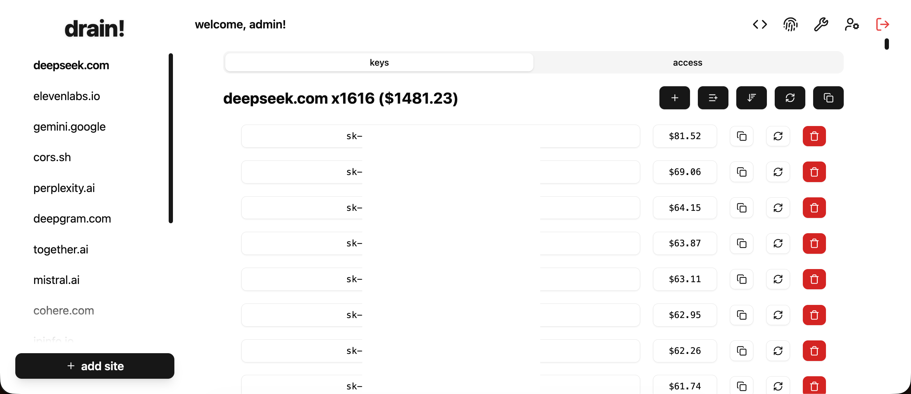

    
    <h1>Drain</h1>
    <h3>a key storage tool designed for the paranoid</h3>

  

<h2 align='center'>Features</h2>

- Clean API Key management interface
- Key balance detection/validation
- Bulk imported keys
- Vast per-site permission system
- Instance-only API Keys
- Passkey/WebAuthn Login
- Global admin configuration
- Simple user management

<h2 align='center'>Setup</h2>

1. Install [Bun](https://bun.sh)
2. Clone the repo: `git clone https://github.com/VillainsRule/Drain && cd Drain`
3. Add voauth information: `bun editenv`
4. Prepare for production: `bun prep`
5. Start the production server: `bun start`

> [!NOTE]
> Bun is required, thanks to the built-in mime type list (i'm lazy) and built-in proxy support.

 <h2 align='center'>Useful Notes for Deployment</h2>

All Drain logins are now processed through voauth. If you own a Drain instance (I don't believe anyone does, but who knows?), users will be able to migrate upon login. If you don't like this, you're welcome to freeze Drain at the commit `f251d3f` and ignore all commits after that. You can also [self-host voauth](https://github.com/VillainsRule/voauth).

The core administrator account is named "admin" with the user ID "1". admin has access to all sites and all users. admin cannot be demoted or deleted. admin has access to all sites, forever. When you start up the drain instance for the first time, to login and link a voauth account, use the invite code `admin`.

If you manually change any database files while Drain is running, Drain will automatically overwrite your changes. Turn off Drain to do any manual database changes.

  
<h5 align='center'>made with ❤️ by <b>VillainsRule</b></h5>